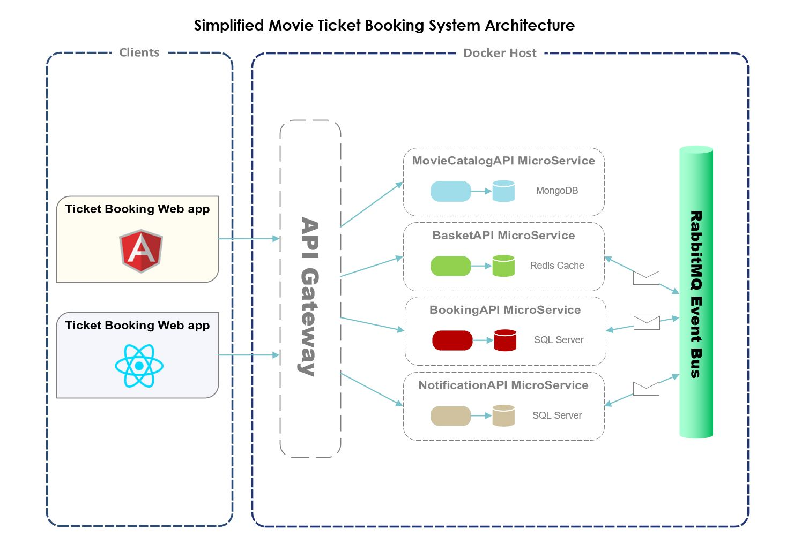
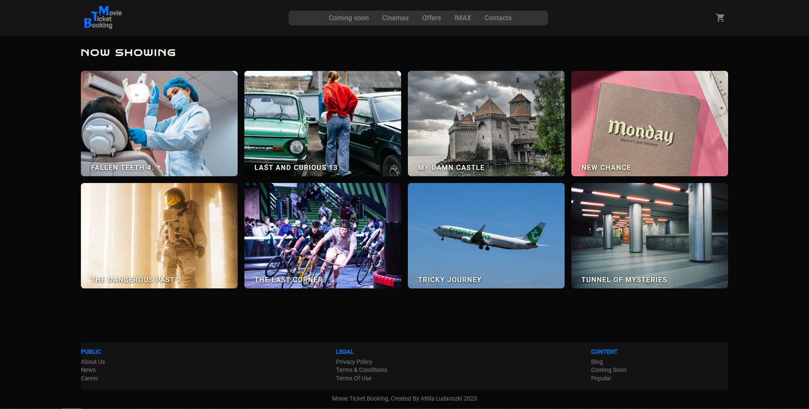

# Movie Ticket Booking Application

## Overview

This application is a simplified movie ticket booking system - which made as a hobby project - and based on a backend with microservices architecture which runs in the Docker containers. The backend serves two frontends which have almost same functionality, but created with different technologies and user interfaces.

## Used technologies

### Backend
- .Net 6 for microservices, libraries
- MS-SQL as a microservice's database
- MongoDb as a microservice's database
- Redis as a microservice's database
- Ocelot API gateway to forward incoming HTTP request to the appropriate WebAPI service
- RabbitMQ message broker for indirect internal communication between microservices
- Docker for all of the above to work well together in a container

### Frontend
- Angular 15 with Angular Material and NGX Bootstrap
- React 18 with Material UI

## Application's architecture



## Getting started

### Backend

If you want to try this application then make sure you have installed [NodeJS](https://nodejs.org/en), [.Net6](https://dotnet.microsoft.com/en-us/download/dotnet/6.0) and [Docker Desktop](https://www.docker.com/products/docker-desktop/) according to your computer's operation system.

If everything is fine, you can run the below commands from your root source directory (where the docker-compose files can be located).

```
docker-compose build
docker-compose up -d
```

After the commands have been successfully run you can try the backend API's through their Swagger page by using the below links (NotificationAPI has no operations defined):

- [BookingAPI](http://host.docker.internal:5402/swagger)
- [BasketAPI](http://host.docker.internal:5401/swagger)
- [MovieCatalogAPI](http://host.docker.internal:5400/swagger)

Check the other services with these information:

1. MS-SQL (Management Studio): 
    - Server name:      `host.docker.internal,1533`
    - Login/password:   `sa/Mtbs2023*`
2. [Redis Commander](http://host.docker.internal:8081/) `(root/secret)`
3. [RabbitMQ](http://host.docker.internal:15672/) `(guest/guest)`
4. [Mongo Express](http://host.docker.internal:8800/)


### Frontend

At first you have to install npm packages for both clients. After the installations have been successfully finished, you can start the frontend applications as usual (if you need some help with this, check the [Angular](Clients/angularclient/README.md) or [React](Clients/reactclient/README.md) readme files), let's say in the [VS Code](https://code.visualstudio.com/) or any other code editor.
If every installation steps were successful both backend and frontend side you can start the clients and will see these starting screens:

>Angular client


>React Client


